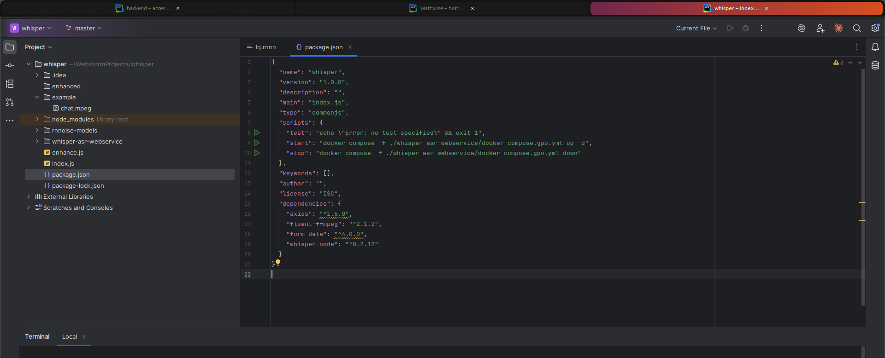

# Tabby Windows

GNOME Shell extension that lets you group windows of the same application as **browser-like tabs**. No tiling, no auto-layout — just tabs.




## Features

- **Tab grouping** — Group all windows of the focused app into a single tab bar
- **Drag to reorder** — Rearrange tabs by dragging them to a new position
- **System theme colors** — Bar and accent colors are read from your GNOME/Ubuntu theme and accent-color setting
- **Instant switching** — No minimize/unminimize animations when switching tabs
- **Position tracking** — Tab bar follows the window when moved or resized
- **Close button** — Each tab has a close button to remove it from the group
- **Auto-grouping** — New windows of an already-grouped app are automatically added as tabs
- **Pointer cursor** — Cursor changes to a hand when hovering over tabs

## Keyboard Shortcuts

| Shortcut | Action |
|---|---|
| `Super + T` | Group / Ungroup windows |
| `Ctrl + Super + Right` | Next tab |
| `Ctrl + Super + Left` | Previous tab |
| `Super + Shift + T` | Remove current window from group |

## Installation

### Quick Install

```bash
git clone https://github.com/USER/tabby-windows.git
cd tabby-windows
chmod +x install.sh
./install.sh
```

Then **log out and log back in** (Wayland) or press `Alt+F2` → `r` → `Enter` (X11).

### Manual Install

```bash
EXT_DIR="$HOME/.local/share/gnome-shell/extensions/tabby-windows@custom"
mkdir -p "$EXT_DIR/schemas"
cp extension.js stylesheet.css metadata.json "$EXT_DIR/"
cp schemas/*.xml "$EXT_DIR/schemas/"
glib-compile-schemas "$EXT_DIR/schemas/"
gnome-extensions enable tabby-windows@custom
```

## How It Works

1. Focus any application window
2. Press `Super + T` — all windows of that app on the current workspace are grouped as tabs
3. A tab bar appears above the window showing all grouped windows
4. Click a tab or use `Ctrl + Super + Right` / `Ctrl + Super + Left` to switch
5. Drag tabs to reorder them
6. Press `Super + T` again to ungroup

## Compatibility

- GNOME Shell 46, 47
- Ubuntu 24.04+, Fedora 40+, or any distro with GNOME 46+
- Works on both Wayland and X11
- Accent colors are read from `org.gnome.desktop.interface accent-color` (falls back to blue)

## License

GPL-3.0
